# [Google Skywater 130nm](https://github.com/google/skywater-pdk) Comparator IP

## Introduction
A comparator is a device that compares two analog inputs and outputs a digital signal indicating which input is larger. So it has two analog input terminals and one binary digital output. 
When the difference between two analog input signals approach zero, noise on the inputs will cause spurious switching of digital output. This rapid change in output due to noise can be prevented by hysteresis. Hysteresis is switching the output high or low at different input signal levels. In place of one switching point, hysteresis introduces two: one for rising edge, and one for falling edge of voltage or current. The difference between the higher-level trip value (VH) and the lower-level trip value (VL) equals the hysteresis voltage (HYST).

## Specifications
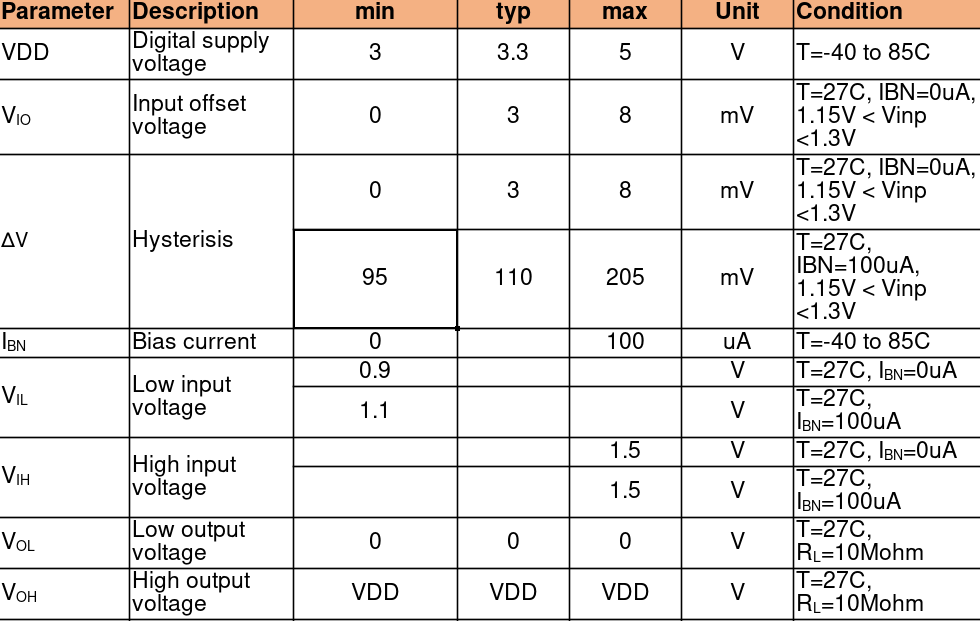

## Comparator Circuit
Below is comparator circuit diagram used for this IP
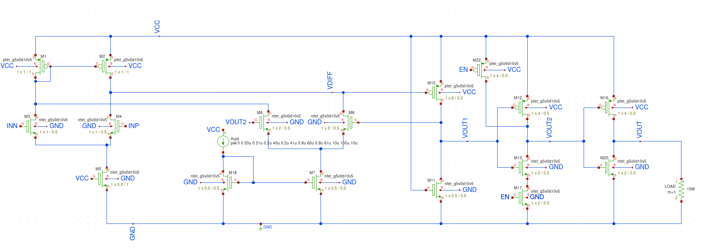

### Inputs to the circuit
1. VCC - 3.3 v
2. GND - Ground
3. INN - Negative differential input
4. INP - Positive differential input
5. EN  - Enable pin
6. Ihyst - Current to control hysteresis

### Output of the circuit
1. VOUT - Comparator output

### Circuit details
A comparator can be divided into three distinctive pieces – a frontend differential amplifier, amplifier stage and output stage.

A brief literature survey is at [pdf](Docs/Low power current programmable CMOS comparator with hysteresis.pdf)

This comparator consists of
1. Frontend differential amplifier
2. Amplifier of the output from frontend differential sage
3. NAND gate to act as buffer as well as incorporate the enable pin
4. Inverter to act as final buffer before output. The NAND and Inverter improves the slew and provides a little gain.
5. Positive feedback differential set-up. 

This is very similar to set-up on [2] but I have added some modifications to incorporate ENable pin and improve the performance on SKY130 PDK.

## Prelayout Circuit Simulation
The circuit was simulated at multiple currents to control hysteresis
1. 0.0 uA
2. 0.2 uA
3. 0.8 uA
4. 10  uA 

### Ihsyst = 0
This should behave like a comparator with no hysteresis. The output voltage VOUT changes eachtime INP crosses INN
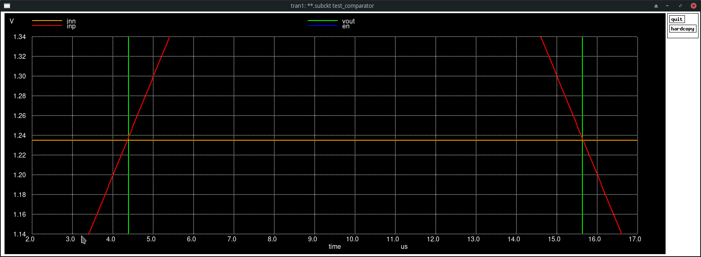

### Ihsyst = 0.2 uA
This should have slight hysteresis. Observed VTH = 1.3mV
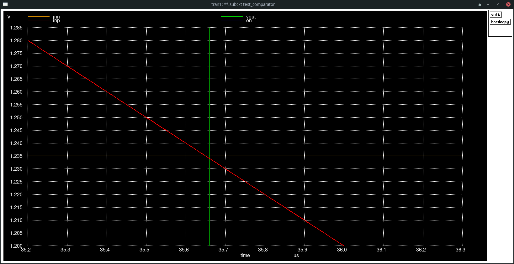

### Ihsyst = 0.8 uA
This should have slight hysteresis. Observed VT = 10.3 mV
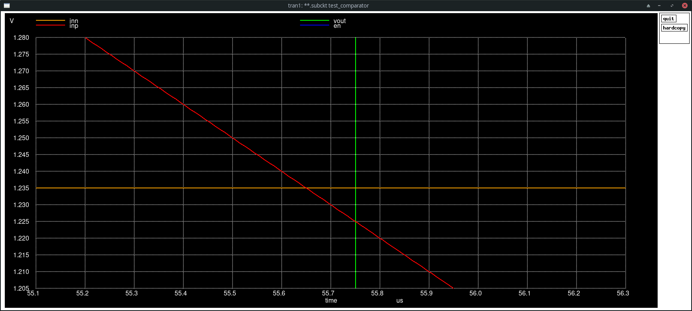

### Ihsyst = 10 uA. Observed VT = 169.29 mV
This should have more hysteresis compared to the earlier simulations
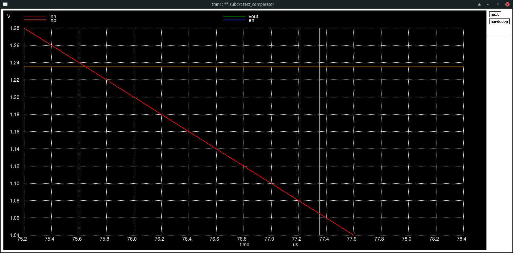

### Steps to replicate prelayout simulation
```
git clone https://github.com/siliconwiz/sky130_comparator_ip
cd sky130_comparator_ip/PreLayout/Spice
ngspice comparator.spice
```

or run the xschem project is in Prelayout folder.
Xschem can be set-up using [this link](https://www.youtube.com/watch?v=jXmmxO8WG8s)

The output should be
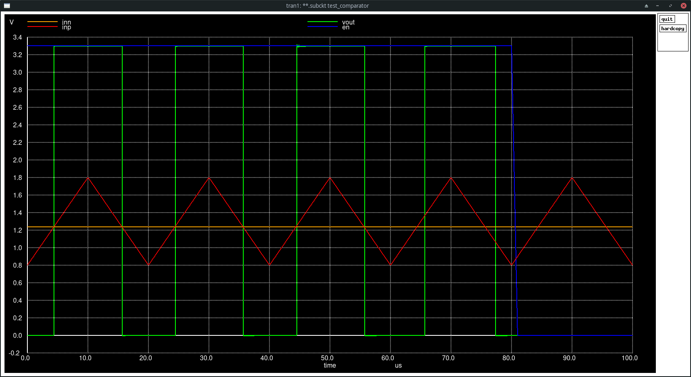

### Layout

The magic layout is as 

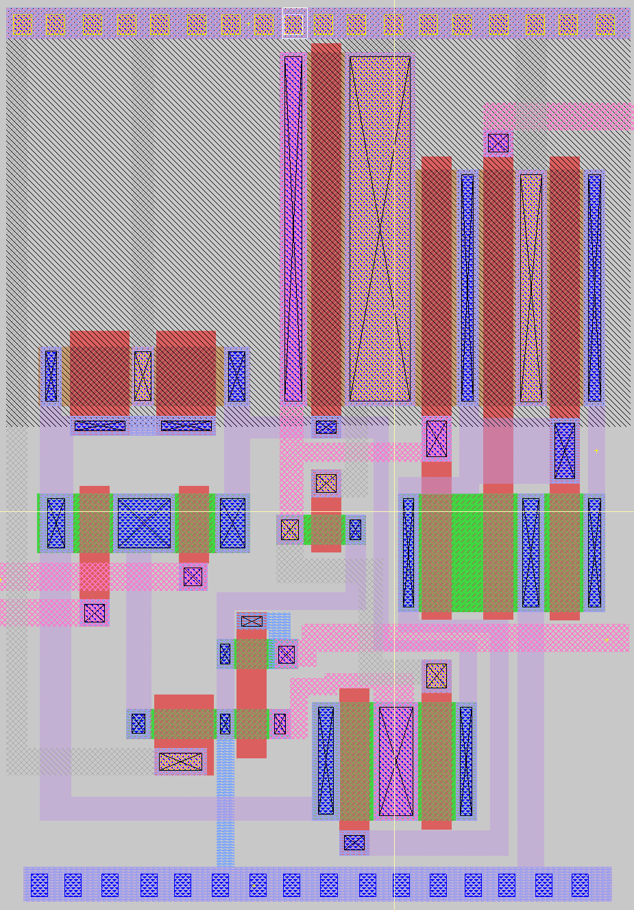

## Postlayout Circuit Simulation

Below is the postlayout simulation results
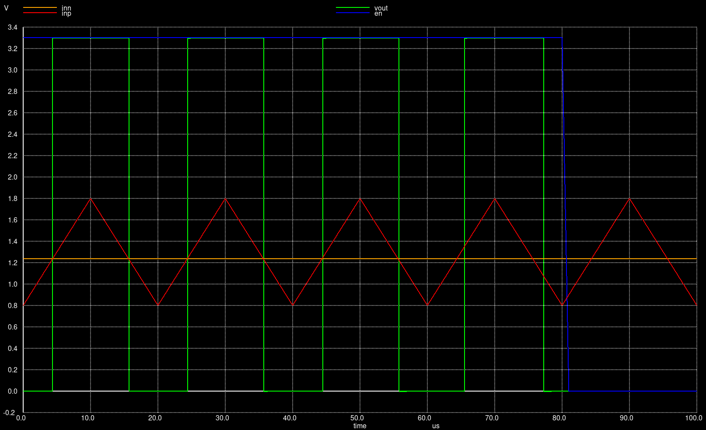

Postlayout hysteresis at 0uA
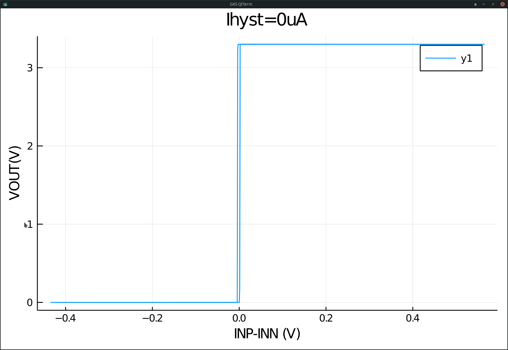

Postlayout hysteresis at 0.2uA
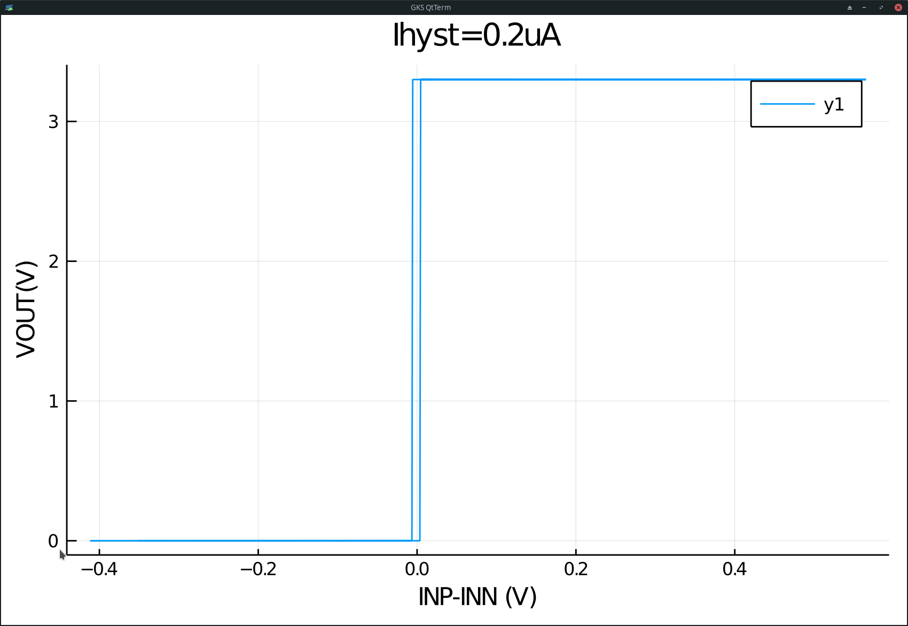

Postlayout hysteresis at 0.8uA
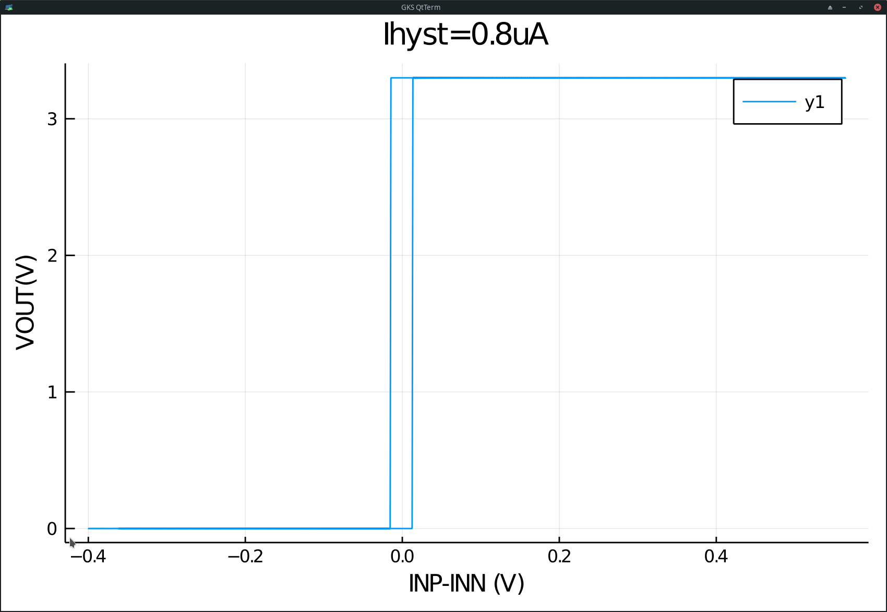

Postlayout hysteresis at 10uA
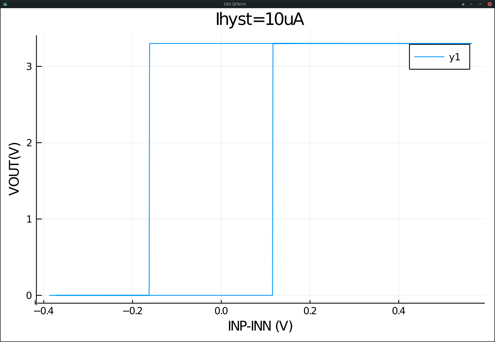

### Steps to replicate postlayout simulation
```
git clone https://github.com/siliconwiz/sky130_comparator_ip
cd sky130_comparator_ip/Layout/Spice
ngspice comparator_postlayout.spice
```

The layout should be as dipicted in previous section above.

## Specifications


## Areas of improvement
The hysteresis at lower differential voltage is higher than the hysteresis at higher differential voltage.
A few variations of the circuit were tried as present in the PreLayout/archive folder. 

## References
1. P. Horowitz,and W. Hill, “The Art of Electronics,” Cambridge Press University, 3rd ed (references) 
2. P. Furth, Y. Tsen, V. Kulkarni,and T. Raju, On the Design of Low-Power CMOS Comparators with Programmable Hysteresis., IEEE, 2010, pp.1077–1080.
